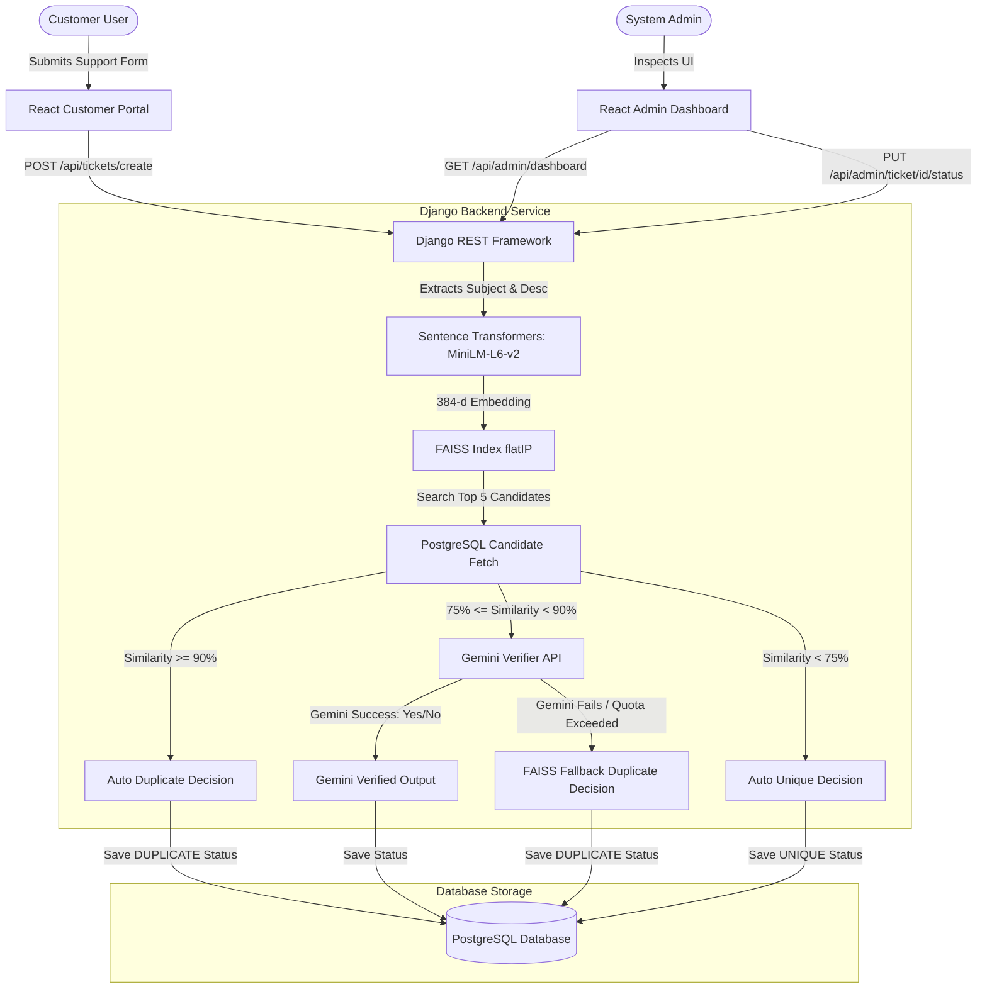

# Smart Issue Tracker: Hybrid AI Duplicate Ticket Detection & Management System

[](https://djangoproject.com/)
[](https://reactjs.org/)
[](https://www.typescriptlang.org/)
[](https://www.postgresql.org/)
[](#)
[](https://deepmind.google/technologies/gemini/)

An enterprise-grade Customer Support Ticketing Portal built on a decoupled SPA-API architecture. The application integrates **Dense Semantic Vector Embeddings** (FAISS) with **Large Language Models** (Google Gemini) to automatically detect, link, and manage duplicate support ticket submissions in real time. 

---

## 📖 Project Overview

### The Problem
Customer support departments in growing enterprises are routinely inundated with duplicate ticket submissions. Outages, recurring billing failures, or system hiccups prompt multiple users to submit identical requests. Manually sorting through these duplicates:
* Consumes significant support representative hours.
* Artificially inflates backlog metrics.
* Delays response times for unique, critical support items.
* Prevents teams from accurately calculating issue severity based on incident frequency.

### The Solution
The **Smart Issue Tracker** automates duplicate detection. It combines dense semantic vector representation with structured Large Language Model validation. When a customer submits a ticket:
1. It is converted into a semantic embedding.
2. It is matched against database records via vector indexing to find highly similar issues.
3. Depending on the similarity score, it is either marked as a duplicate automatically, routed to Gemini AI for verification, or classified as a unique master ticket.
4. Linked duplicate submissions automatically increment the supporter counts of their master tickets rather than cluttering support grids, allowing teams to immediately prioritize issues by customer impact.

---

## ✨ Features

* **Intake Form Portal**: Markdown-ready support ticketing interface dynamically indexing requests.
* **Hybrid Deduplication Pipeline**: Combining ultra-fast local vector search (FAISS) with high-accuracy LLM validation (Gemini AI).
* **FAISS Vector Search**: Leverages `all-MiniLM-L6-v2` to map ticket subjects and descriptions into 384-dimensional dense vectors, looking up matches via a local Flat Inner-Product index.
* **Gemini LLM Verification**: Validates edge-case matches using `gemini-1.5-flash` with structured Pydantic response schemas, automatic rate-limit retries, and exponential backoff fallbacks.
* **Admin Dashboard**: Visualizes ticket volume charts, duplicate rates, monthly statistics, and live activity feeds.
* **Ticket Management Panel**: Admins can assign tiers, update ticket status, and manually override system verdicts.
* **Analysis History Logs**: Captures and shows exact decision flows, cosine similarity scores, system verdicts, and Gemini LLM reasoning.

---

## 🛠️ Technology Stack

### Frontend
* **React 18**: Component-driven SPA user interface.
* **TypeScript**: Typed safety across routes, states, and API payloads.
* **Vite**: Rapid asset bundle packaging and hot-reload local server.
* **Tailwind CSS**: Utility-first CSS layout styling.
* **Lucide React**: Vector icons and design components.

### Backend
* **Django 5**: Secure, batteries-included web framework.
* **Django REST Framework (DRF)**: Web-API serialization and permissions filtering.
* **Corsheaders**: Resolves Cross-Origin Resource Sharing (CORS) configurations.

### AI & NLP Layer
* **FAISS (cpu)**: Facebook AI Similarity Search Flat Inner Product index for cosine similarity queries.
* **Sentence-Transformers**: Compact, CPU-efficient sentence embedding model (`all-MiniLM-L6-v2`).
* **Google Generative AI**: Accesses Gemini models using GenerationConfig schema interfaces.

---

## 📂 Folder Structure

```text
Smart-Issue-Tracker/
│
├── Project/
│   ├── backend/               # Django support ticket backend logic
│   ├── smart_issue_tracker/   # Django project settings & routing configuration
│   ├── src/                   # React + TypeScript frontend code
│   ├── public/                # Static public assets for React frontend
│   ├── manage.py              # Django command-line management script
│   ├── requirements.txt       # Python backend package requirements
│   ├── package.json           # Frontend dependencies and npm scripts
│   ├── package-lock.json      # NPM lock file
│   ├── vite.config.ts         # Vite compilation configuration
│   └── README.md              # Original technical README
│
├── Team_Resumes/              # Portfolio Resumes
│   ├── Vasiharan_Resume.pdf
│   ├── TeamMember2_Resume.pdf
│   ├── TeamMember3_Resume.pdf
│   └── TeamMember4_Resume.pdf
│
├── Screenshots/               # Mockups & System View Captures
│   ├── User_Submission_Page.png
│   ├── Dashboard.png
│   ├── Previous_Tickets.png
│   ├── Analysis_History.png
│   ├── Categories.png
│   └── Settings.png
│
├── Documentation/             # Comprehensive Project Documentation
│   ├── Project_Report.pdf
│   ├── Architecture_Diagram.pdf
│   ├── Dependency_Validation_Report.pdf
│   ├── Workflow_Document.pdf
│   └── Presentation.pptx
│
├── README.md                  # Main Release README (this file)
├── LICENSE                    # MIT License file
└── .gitignore                 # Version control exclusions
```

---

## ⚙️ System Architecture

The application is structured as a decoupled SPA-API layout, utilizing React on the frontend and Django REST Framework on the backend, communicating over a JSON API.



---

## 🚀 Installation & Setup

Before starting, ensure you have **Python 3.10+** and **Node.js 18+** installed.

### 1. Database Setup (PostgreSQL)
Establish a local database instance (e.g. `smart_issue_tracker`). If PostgreSQL is unavailable, you can switch the backend database provider to `sqlite3` inside [Project/smart_issue_tracker/settings.py](file:///Project/smart_issue_tracker/settings.py).

### 2. Backend Installation
Navigate into the `Project/` folder and setup your virtual environment:

```bash
# Navigate to the project directory
cd Project

# Initialize a virtual environment
python -m venv venv

# Activate venv (Windows)
venv\Scripts\activate
# Activate venv (macOS/Linux)
# source venv/bin/activate

# Install dependencies
pip install -r requirements.txt
```

### 3. Environment Variables
Create a `.env` file inside the `Project/` folder. Populate it with the following configuration values:
```ini
GEMINI_API_KEY=your_gemini_api_key_here
GEMINI_ENABLED=True
DJANGO_DEBUG=True
DJANGO_SECRET_KEY=development_cryptographic_secret_key_here
POSTGRES_DB=smart_issue_tracker
POSTGRES_USER=postgres
POSTGRES_PASSWORD=your_password
POSTGRES_HOST=127.0.0.1
POSTGRES_PORT=5432
DEDUPLICATION_SIMILARITY_THRESHOLD=0.75
DEDUPLICATION_CONFIDENCE_THRESHOLD=80
```

### 4. Running Backend migrations & starting server
Inside `Project/` folder with virtual environment active:
```bash
python manage.py migrate
python manage.py createsuperuser
python manage.py runserver
```
The Django server starts at `http://127.0.0.1:8000/`.

### 5. Frontend Installation & Startup
Open a new terminal window, navigate to the `Project/` folder, and launch Vite's hot-reload developer server:
```bash
cd Project
npm install
npm run dev
```
The frontend portal starts at `http://localhost:5173/`.

---

## 📊 Screenshots

Here are visual representations of the application views (available inside the [Screenshots](file:///Screenshots/) directory):

### User Ticket Submission Page


### Admin Dashboard Overview


### Previous Tickets Grid


### Analysis History Audits


### Categories Panel


### Settings Page


---

## 👥 Team Members & Resumes

Our development team represents diverse engineering disciplines:

* 👤 **Vasiharan** — *Lead Software Engineer & RAG Architect*
  * Responsible for core hybrid deduplication logic, FAISS indexing, Django services layer, and DB design.
  * 📄 [Vasiharan_Resume.pdf](Team_Resumes/Vasiharan_Resume.pdf)
* 👤 **Surhendhaar V** — *Frontend UI/UX Specialist*
  * Developed the React application, dashboard layouts, custom data visualizations (Recharts), and responsive intake interface.
  * 📄 [Surhendhaar_Resume.pdf](Team_Resumes/Surhendhaar_Resume.pdf)
* 👤 **Mamuduri Kowshik S** — *Backend & Database Engineer*
  * Maintained relational consistency, handled migrations, optimized PostgreSQL queries, and structured DRF serialization layers.
  * 📄 [Mamuduri_Kowshik_S.pdf](Team_Resumes/Mamuduri_Kowshik_S.pdf)
* 👤 **Viveka** — *DevOps, QA, & Integration Architect*
  * Created unit test suites, structured the Gemini verification retry mechanics, handled security audits, and mapped build pipelines.
  * 📄 [Viveka_Resume.pdf](Team_Resumes/Viveka_Resume.pdf)

---

## 📄 Documentation

A suite of technical specifications and guides has been curated to document this submission:
* [Project Report](Documentation/Project_Report.pdf) - Extensive structural requirements documentation.
* [Architecture Diagram](Documentation/Architecture_Diagram.pdf) - Detailed visual blueprint of components, connections, and database relations.
* [Dependency Validation Report](Documentation/Dependency_Validation_Report.pdf) - Exhaustive listing and validation checks of python and node packages.
* [Workflow Document](Documentation/Workflow_Document.pdf) - Step-by-step description of user, administrator, and AI verification loops.
* [Presentation Slides](Documentation/Presentation.pptx) - Project submission pitch slides.

---

## 🧪 Test Cases

We have prepared a robust testing suite containing functional, integration, and security checks:
* 📄 **[test_cases.xlsx](file:///Test_Cases/test_cases.xlsx)**: A spreadsheet of 15 realistic user/admin test cases.
* 📕 **[test_report.pdf](file:///Test_Cases/test_report.pdf)**: A formal QA verification report detailing pass rates, environments, and coverage.
* 🐍 **[test_duplicate_pipeline.py](file:///Test_Cases/test_duplicate_pipeline.py)**: Automated unit testing validation suite for backend services.
* See the [Test Cases README](file:///Test_Cases/README.md) for full execution guidelines.

---

## 📊 Sample Data

A mockup dataset is provided to inspect pipeline matching behavior:
* 📥 **[sample_input_tickets.json](file:///Sample_Data/sample_input_tickets.json)**: Realistic inputs representing unique, exact duplicate, and semantically similar tickets.
* 📤 **[expected_output.json](file:///Sample_Data/expected_output.json)**: Expected system response values, verdicts, confidence metrics, and matching routes.
* See the [Sample Data README](file:///Sample_Data/README.md) for execution details.

---

## 🤖 AI Usage Note

AI tools were leveraged to accelerate boilerplate creation, structural layouts, and test mocks:
* 📄 **[AI_Usage_Note.md](file:///AI_Usage_Note/AI_Usage_Note.md)**: Details the AI assistants used, prompts drafted, issues resolved, code manually refactored, and technical lessons learned.

---

## 🎥 Demo Video

* 📄 **[demo_video_link.txt](file:///Demo_Video/demo_video_link.txt)**: Reference link containing the video walkthrough demonstrating the application intake portal, admin dashboard operations, and AI classification outputs.

---

## 📋 Submission Deliverables Checklist

- [x] Reorganized folder structure (`Project/`, `Team_Resumes/`, `Screenshots/`, `Documentation/`)
- [x] Professional root `.gitignore` and MIT `LICENSE`
- [x] Detailed main `README.md` and project architecture docs
- [x] 15 QA Test Cases in `test_cases.xlsx` and `test_report.pdf`
- [x] Mockup JSON input datasets and expected pipeline outputs
- [x] AI Usage guidelines document (`AI_Usage_Note.md`)
- [x] Running servers verification (React builds and Django checks passing)

---

## 🔮 Future Enhancements

* **Multi-Tenant Support**: Restructure models to support organizational scoping, separating vector indices and category pools.
* **Email Merging Alerts**: Instantly email clients when their requests are marked as duplicate and successfully mapped.
* **Real-Time WebSockets**: Introduce Django Channels for real-time ticket additions and statistics syncs on the dashboard.
* **Unsupervised Clustering**: Introduce DBSCAN vector analysis to reveal emerging trends and outages prior to manual tag definitions.
* **Cloud Containerization**: Package services using Docker and connect external managed vector stores (such as Pinecone or pgvector).

---

## 📄 License

This project is licensed under the MIT License - see the [LICENSE](file:///LICENSE) file for details.
